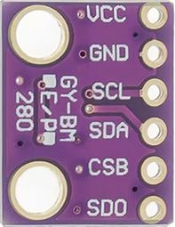
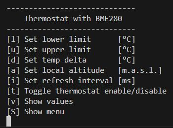
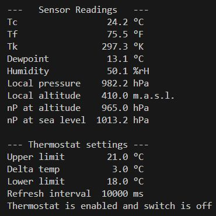

## Universal Thermostat with BME280 Sensor
In this program, the universal thermostat is operated with a BME280 
sensor instead of the NTC sensor. 

It measures

- Temperature in °C, °F, °K
- relative Humidity in %
- Air pressure in hPa

and calculates 

- Dewpoint in °C
- Local normal air pressure in hPa at a given altitude in m.a.s.l. 

|Command Line Interface|Output|
|:--------------------:|:----:|
|||
